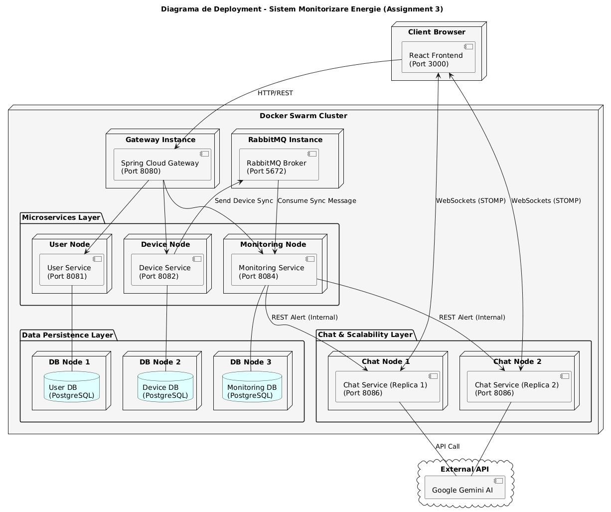

# Energy Monitoring System (EMS)

## Project Description
The Energy Monitoring System is a distributed full-stack application designed to track, manage, and analyze electricity consumption for smart devices. The platform provides a dual-interface system where Administrators manage the infrastructure (users and devices), while Clients monitor their energy usage in real-time. The system acts as an intelligent supervisor, utilizing asynchronous communication to process data streams and providing instant feedback to users through automated alerts and AI-driven support.


## Technical Architecture
The project is built on a **Microservices Architecture** using **Java 21** and **Spring Boot 3**. Each service is decoupled and maintains its own dedicated **PostgreSQL** database to ensure data isolation and system resilience.

### Core Components
* **API Gateway**: Acts as the single entry point, managing request routing and handling security through JWT (JSON Web Tokens).
* **User & Device Management**: Handles CRUD operations and the mapping of smart meters to user accounts.
* **Monitoring & Alerting Service**: Processes energy consumption data and compares it against predefined hourly limits.
* **Communication Layer**: Uses **RabbitMQ** for asynchronous message processing and **WebSockets (STOMP)** for real-time frontend updates.
* **AI Support Module**: Integrates the **Google Gemini API** to provide automated assistance within the chat interface.

## Implementation Phases

### 1. Infrastructure and Security
* Developed a centralized API Gateway to coordinate communication between the React.js frontend and the backend services.
* Implemented a secure authentication flow using JWT, ensuring that user sessions are validated across the entire distributed system.
* Containerized all services using Docker to ensure environment consistency across development and deployment.

### 2. Backend Service Development
* Built RESTful microservices using Spring Boot 3 to handle business logic for device registration and energy tracking.
* Designed isolated database schemas for each service using PostgreSQL, following the "database-per-service" pattern.
* Integrated RabbitMQ to decouple services, allowing the monitoring system to process energy data without impacting the performance of the core management services.

### 3. Real-Time Features and AI Integration
* Established WebSocket connections to push instant notifications to the client dashboard when energy consumption thresholds are exceeded.
* Developed a synchronization logic to handle incoming data from energy meter simulators.
* Implemented an automated support chat by integrating the Gemini API, enabling real-time responses to user queries regarding the system.

### 4. Frontend and Performance Optimization
* Created a responsive user interface using React.js.
* Optimized API calls and state management to ensure real-time data visualization remains fluid.
* Conducted comprehensive testing of the distributed flow, from data ingestion to final user alerting.

## Technology Stack
* **Backend**: Java 21, Spring Boot 3, Spring Security
* **Frontend**: React.js
* **Database**: PostgreSQL
* **Messaging**: RabbitMQ, WebSockets (STOMP)
* **Cloud & DevOps**: Docker
* **AI**: Google Gemini API

## Deployment
The entire system is orchestrated using Docker. To deploy the application, ensure you have Docker installed and run the following command in the root directory:



```bash
docker-compose up --build
